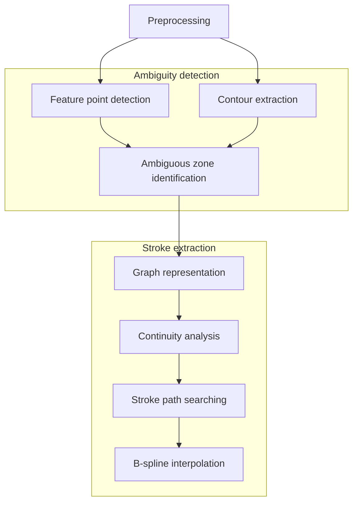

# Stroke extraction based on ambiguous zone detection

## Introduction
This is an implementation of the paper by Su, Z. et al. [^1]. The ultimate goal is to recover dynamic information of handwritten Chinese characters using stroke extraction method based on ambiguous zone detection.

## Method
The general representation of the entire process is as depicted in the flowchart below:

## Reference
[^1]: Su, Z., Cao, Z. & Wang, Y. Stroke extraction based on ambiguous zone detection: a preprocessing step to recover dynamic information from handwritten Chinese characters. IJDAR 12, 109–121 (2009). https://doi.org/10.1007/s10032-009-0085-9 

