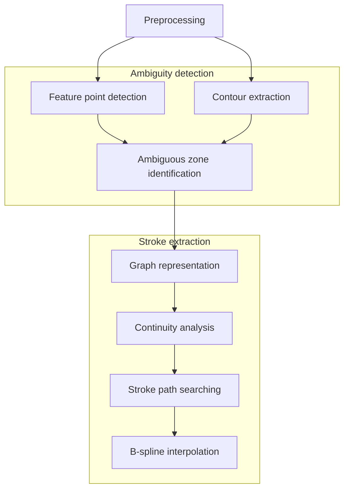

# Stroke extraction based on ambiguous zone detection

## Introduction
This is an implementation of the paper by Su, Z. et al. [^1]. The objective is to recover dynamic information of handwritten Chinese characters using stroke extraction method based on ambiguous zone detection.

## Method
The general representation of the entire process is as depicted in the flowchart below:

## How to run
Under main.m...
1. Import your input image into "./image/", and modify the `filename` variable.
2. Run preprocess.m to produce binarized image.
3. Find `contour` and `skel` of image.
4. Run featureExtraction.m to find junction points (CFPs).
5. Run doubleThreshold.m to eliminated SCFPs.
6. Find `halfthinned` with kmm and run ambiguousZone.m to emerged potential distorted fork points. 

## Reference
[^1]: Su, Z., Cao, Z. & Wang, Y. Stroke extraction based on ambiguous zone detection: a preprocessing step to recover dynamic information from handwritten Chinese characters. IJDAR 12, 109–121 (2009). https://doi.org/10.1007/s10032-009-0085-9 
[^2]: In-Jung Kim and Jin-Hyung Kim, "Statistical character structure modeling and its application to handwritten Chinese character recognition," in IEEE Transactions on Pattern Analysis and Machine Intelligence, vol. 25, no. 11, pp. 1422-1436, Nov. 2003, doi: 10.1109/TPAMI.2003.1240117.
[^3]: N. A. Shaikh and Z. A. Shaikh, "A Generalized Thinning Algorithm for Cursive and Non-Cursive Language Scripts," 2005 Pakistan Section Multitopic Conference, 2005, pp. 1-4, doi: 10.1109/INMIC.2005.334387.
[^4]: J. Dong, W. Lin and C. Huang, "An improved parallel thinning algorithm," 2016 International Conference on Wavelet Analysis and Pattern Recognition (ICWAPR), 2016, pp. 162-167, doi: 10.1109/ICWAPR.2016.7731637.
[^5]: Herbert Freeman. 1974. Computer Processing of Line-Drawing Images. ACM Comput. Surv. 6, 1 (March 1974), 57–97. https://doi.org/10.1145/356625.356627
